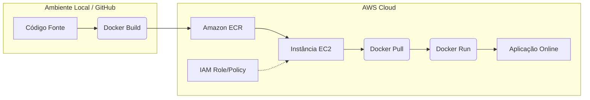

# *DevOps Portfolio: AWS Cloud & Docker Deployment*

---

## 🚀 Sobre o Projeto

Este repositório documenta a implementação de uma arquitetura de deploy conteinerizada utilizando serviços da **Amazon Web Services (AWS)**. O projeto demonstra o fluxo completo de uma aplicação, desde a criação da imagem Docker até a execução em uma instância EC2, focando em segurança (IAM), automação e infraestrutura em nuvem.

> **Nota de Demonstração:** Os recursos da AWS utilizados neste projeto foram provisionados para fins de validação técnica e destruídos após a conclusão para otimização de custos. As evidências de funcionamento estão preservadas na seção de [Evidências](#-evidências-do-projeto).

---

## 🏗️ Arquitetura da Solução

Abaixo, o diagrama que representa o fluxo de integração e entrega da aplicação:



---

## 🛠️ Tecnologias Utilizadas

| Tecnologia | Categoria | Uso no Projeto |
| :--- | :--- | :--- |
| **AWS EC2** | Computação | Hospedagem da aplicação em servidor Linux |
| **AWS ECR** | Registro | Armazenamento privado de imagens Docker |
| **AWS IAM** | Segurança | Gerenciamento de permissões e Roles |
| **Docker** | Conteinerização | Empacotamento e isolamento da aplicação |
| **Linux/Bash** | OS | Configuração do ambiente via CLI e SSH |
| **GitHub** | Versionamento | Controle de versão e documentação |

---

## 📋 Etapas de Implementação

1.  **Desenvolvimento:** Criação de aplicação web com sistema de autenticação.
2.  **Conteinerização:** Escrita do `Dockerfile` e geração da imagem da aplicação.
3.  **Infraestrutura AWS:** 
    *   Provisionamento de instância EC2 (Amazon Linux/Ubuntu).
    *   Criação de repositório privado no Amazon ECR.
    *   Configuração de Security Groups (Portas 22 para SSH e 80 para Web).
4.  **Segurança IAM:** Criação de uma Role específica permitindo que a EC2 realize o `Pull` das imagens no ECR.
5.  **Deploy:**
    *   Autenticação da EC2 no ECR via AWS CLI.
    *   Download da imagem e execução do container Docker.
6.  **Validação:** Testes de acesso externo e análise de logs.

---

## 📂 Estrutura do Repositório

```text
├── website/            # Código fonte da aplicação
├── screenshots/        # Evidências do funcionamento (Imagens)
│   ├── aws/            # Prints do Console AWS (EC2, ECR, IAM)
│   └── terminal/       # Prints dos comandos executados na EC2
├── .gitignore          # Arquivos ignorados (credenciais, logs)
└── README.md           # Guia principal do projeto
```

---

## 📸 Evidências do Projeto

Para validar a execução técnica, as seguintes capturas de tela estão disponíveis na pasta `/screenshots`:

### Console AWS
*   **Instância EC2:** Status "Running" e detalhes da rede.
*   **Security Group:** Regras de entrada configuradas.
*   **Amazon ECR:** Repositório criado com a imagem enviada.
*   **IAM Role:** Política anexada à instância.

### Terminal (Operações EC2)
*   **Login ECR:** Comando `docker login` com retorno "Succeeded".
*   **Docker Pull:** Processo de download da imagem do ECR.
*   **Container Running:** Resultado do comando `docker ps`.
*   **Logs:** Saída do container confirmando a inicialização da aplicação.
*   **Aplicação Web:** Screenshot do navegador acessando o IP da instância.

---

## 💡 Aprendizados e Insights

*   **Segurança Primeiro:** A importância de usar IAM Roles em vez de chaves de acesso estáticas dentro de instâncias.
*   **Portabilidade:** Como o Docker facilita o deploy em diferentes ambientes sem conflitos de dependências.
*   **Gerenciamento de Custos:** Prática de ciclo de vida de recursos (provisionar, validar e destruir).

---

## 🛡️ Boas Práticas de Segurança

Este projeto segue rigorosas normas de segurança:
*   **Nenhuma credencial AWS** foi enviada ao repositório.
*   Uso de `.gitignore` para proteger arquivos sensíveis.
*   Permissões baseadas no princípio do **Menor Privilégio**.

---

## ✍️ Autor

**Yasmin Dantas** - [LinkedIn](https://www.linkedin.com/in/ydantas)

---
*Este projeto faz parte do meu portfólio DevOps e demonstra competências em Cloud Computing e Conteinerização.*
